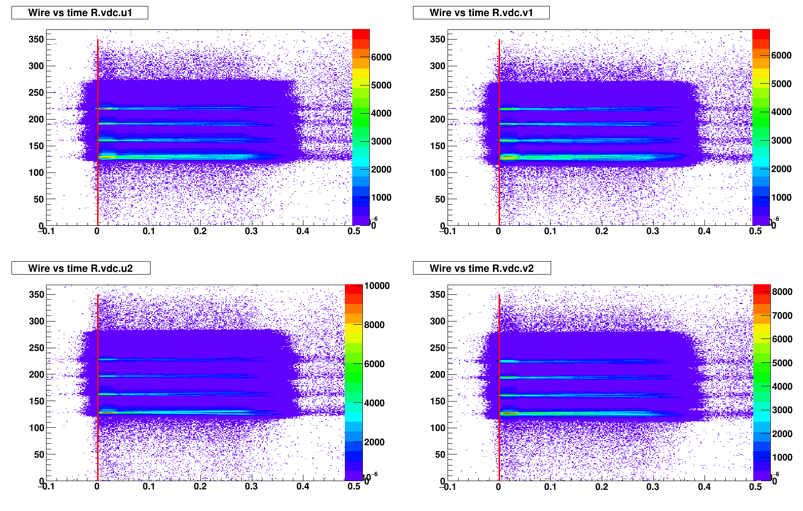
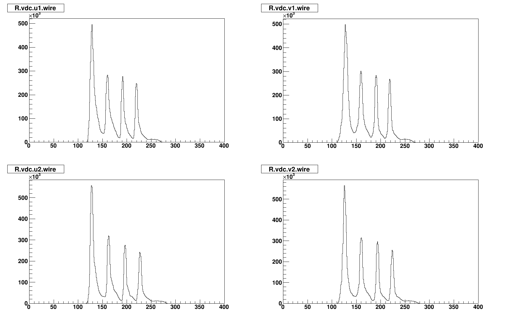

# VDC calibration code 

The calibration code is adapted from Ole Hansen's presentation:[HRS VDC Calibration](https://hallaweb.jlab.org/data_reduc/AnaWork2017/Podd-VDCcalib-2017-06-26.pdf)

github repo: [vdccalib](https://github.com/JeffersonLab/HallAC-Workshop2017/tree/a141b4f5ebe8bb9bc8945d5a06a891589425275d/vdccalib)

Ideally, calibration need sieve out runs and cover all the VDC area(at least area that used in the experiment).


# Usage 

### calibration with C_12 Dp scan runs
```

```

### Check the Calibration result
```
$ analyzer 
$ .L checkVDCtdcCalib.C
$ VDCtdcCalibCheck("R","/home/newdriver/Storage/Research/CRex_Experiment/RasterReplay/Replay/Result/prexRHRS_216*")
```
 <tr>
    <td>  </td>
    <td>  </td>
 </tr>
    
## Key parameters used in the calibration
* 