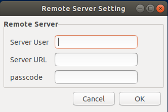
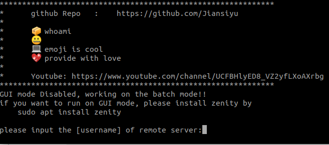

# ssh toolkit

A very naive tool used for send the current client  ssh key to the remote server. It can auto detector the client enviroment to choose GUI or Batch Mode.


### 1. GUI mode
GUI mode need zenity support. If zenity is not installed:

```
sudo apt install zenity -y
```



### 2. batch mode

## Usage

```
bash autossSet.sh
```

or 

```
curl -sL https://raw.githubusercontent.com/Jiansiyu/GeneralScripts/master/autoLogon/autosshSet.sh | bash 

```