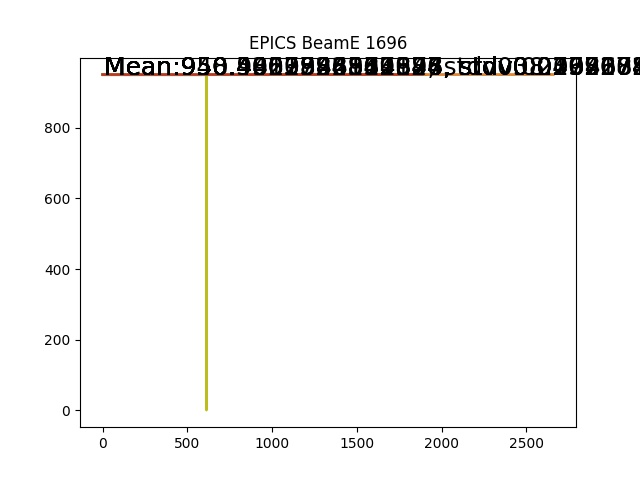

# Hall A log book Crawler

## Get 

## Usage

### Get the list of counting run List AND parity run list

```
curl -sL https://raw.githubusercontent.com/Jiansiyu/GeneralScripts/master/halog/halogcrawler.py | python3
```
The data file will be saved as runList.csv, ParityrunList.csv

### Get the list of counting run List

```
python3 halogcrawler.py counting
```

### Get the list of counting run List

```
python3 halogcrawler.py parity
```


### Generate the EPIC beamE bashscripts 

```
python3 halogcrawler.py [runID]....
```
After run this script, it will generate the bash script used get the EPICS infromations:

```shell script
myget -b "2019-06-26 23:12:33" -e "2019-06-26 23:23:27" -c HALLA:p > RHRS_1694_BeamE.txt
myget -b "2019-06-26 23:44:52" -e "2019-06-27 00:37:32" -c HALLA:p > RHRS_1695_BeamE.txt
myget -b "2019-06-27 01:30:26" -e "2019-06-27 02:02:04" -c HALLA:p > RHRS_1696_BeamE.txt
myget -b "2019-06-26 07:06:39" -e "2019-06-26 07:39:10" -c HALLA:p > RHRS_1672_BeamE.txt
myget -b "2019-06-26 08:31:30" -e "2019-06-26 08:59:57" -c HALLA:p > RHRS_1673_BeamE.txt
myget -b "2019-06-26 09:41:26" -e "2019-06-26 10:28:50" -c HALLA:p > RHRS_1676_BeamE.txt
myget -b "2019-06-26 09:11:14" -e "2019-06-26 09:20:51" -c HALLA:p > RHRS_1675_BeamE.txt
myget -b "2019-06-26 10:41:59" -e "2019-06-26 11:01:02" -c HALLA:p > RHRS_1677_BeamE.txt
```

Need to run this bash script on the apar.

### Create BeamE information 


```python
python getBeamPlot.py
```
It will read the runList file in folder 'runList/runlist.txt'
