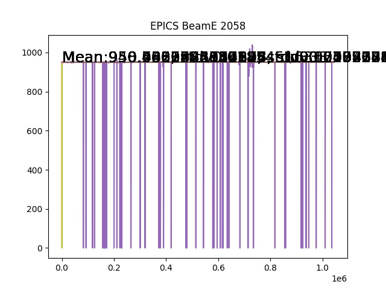

# Check the Simulation and the Data 

## C-1% Run

* LHRS 2302 

  - BeamE ( EPICS does not have the beam information )
    run 2304: 950.718
    

* RHRS 21424
  - BeamE
    

## Lead Run 

* LHRS 2055 
  - Beam E
    
    

* RHRS 21188
  

## Ca40 Check

* LHRS 2297
* RHRS 21419